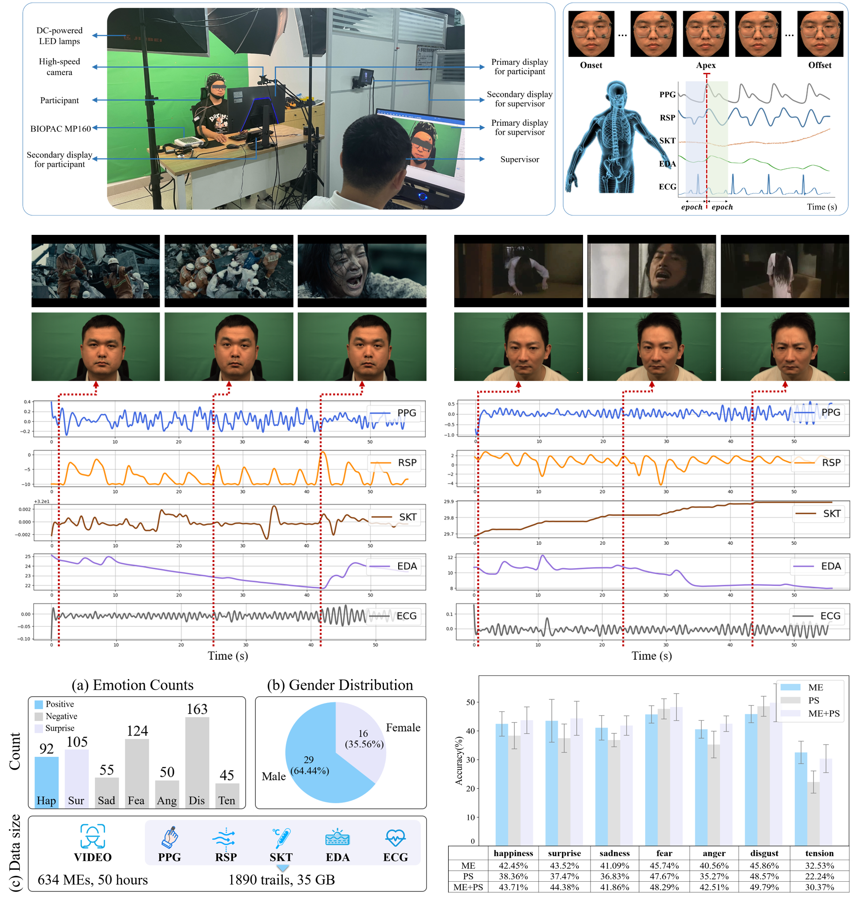

# Unveiling Genuine Emotions: Integrating Micro-Expressions and Physiological Signals for Enhanced Emotion Classification

Micro-expressions (MEs) can reveal human's genuine emotions, which has led to increasing attention in the field of emotion recognition. Variations in physiological signals (PS), such as electrocardiograms (ECG), electrodermal activity (EDA), and respiration (RSP), can reflect emotional fluctuations. Integrating these modalities is expected to enhance emotion recognition performance. Currently, there are very few publicly available databases that simultaneously collect MEs and multimodal physiological data. To validate this hypothesis, we collected facial ME images and multimodal PS data from 45 participants in response to seven emotional stimuli, resulting in 643 ME samples and 1,890 trials of multimodal physiological data. After preprocessing and feature extraction, we employed a multimodal fusion strategy to validate the database. The experimental results demonstrate that the fusion of MEs with PS outperforms methods using a single modality. This research not only addresses the limitations of existing ME databases but also provides valuable data for exploring the relationships and potential mechanisms between MEs and various PS.

# Experimental Scene and Results

# How to get

This database is publicly available for any academic use. To obtain it, please sign the release agreement and send a scanned copy to ustb_machuang@163.com.
