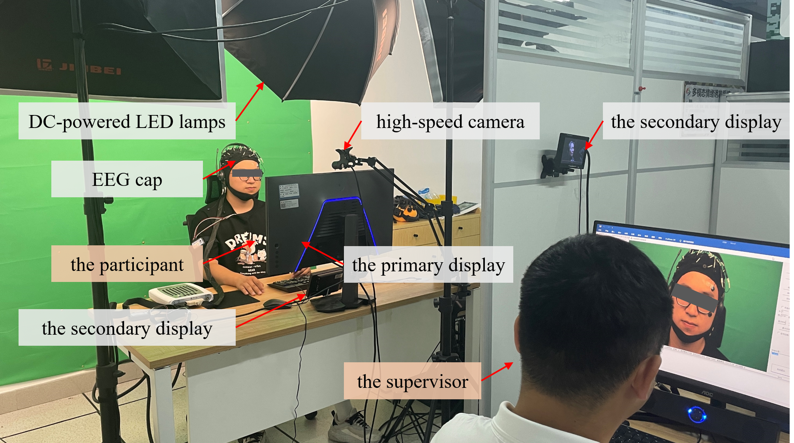
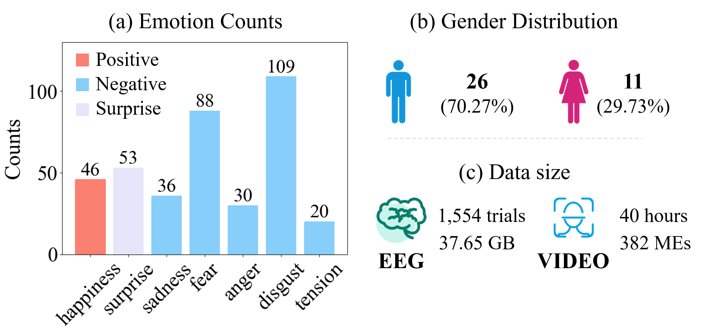
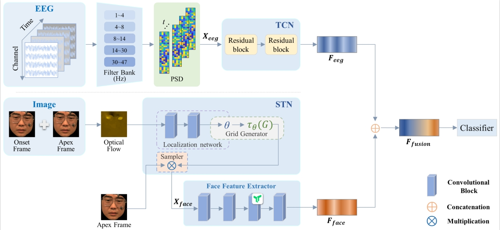

# Unveiling Genuine Emotions: Integrating Micro-Expressions and Physiological Signals for Enhanced Emotion Classification

Micro-expressions (MEs) can reveal human's genuine emotions, which has led to increasing attention in the field of emotion recognition. However, research on MEs has primarily focused on computer vision techniques, with limited integration of physiological signals (PS). Variations in PS, such as electrocardiograms (ECG), electrodermal activity (EDA), and respiration (RSP), can reflect emotional fluctuations. Integrating these modalities is expected to enhance emotion recognition performance. Currently, there are very few publicly available databases that simultaneously collect MEs and multimodal physiological data. To validate this hypothesis, we collected facial ME images and multimodal PS data from 45 participants in response to seven emotional stimuli, resulting in 643 ME samples and 1,890 trials of multimodal physiological data.

# Contact information
To request a copy of this database, please send email to ustb_machuang@163.com.
